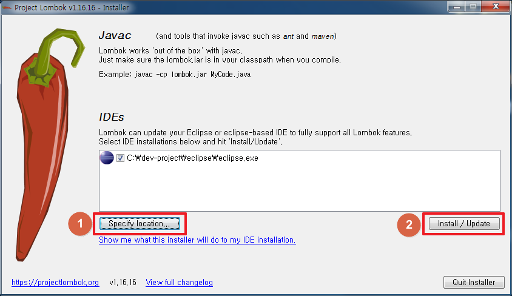
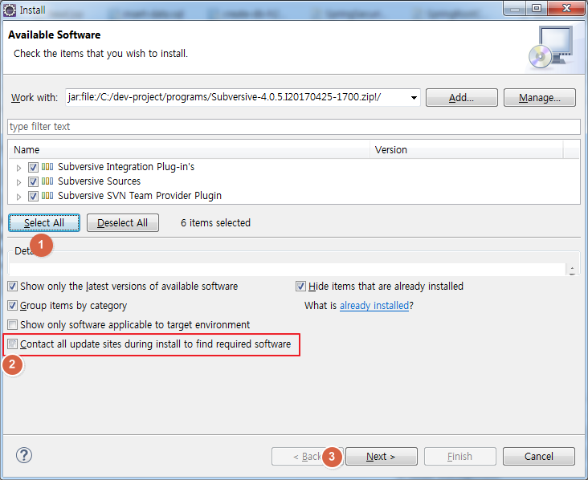
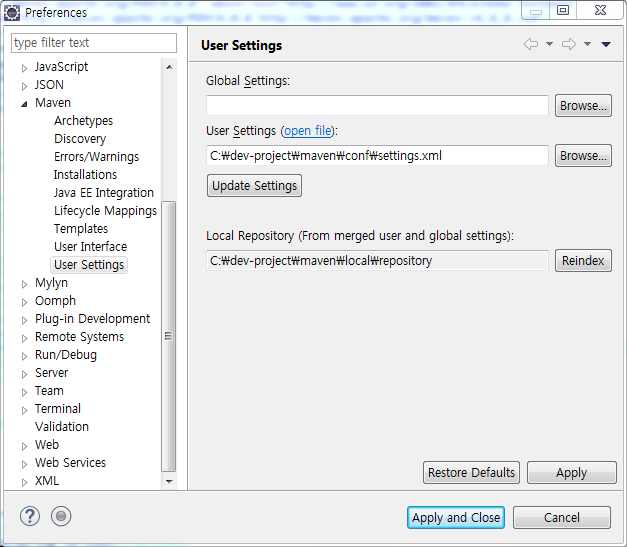
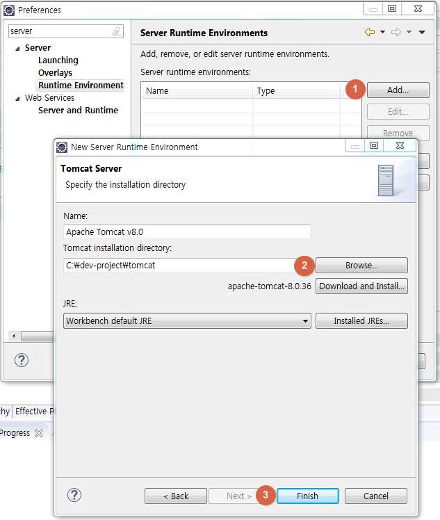
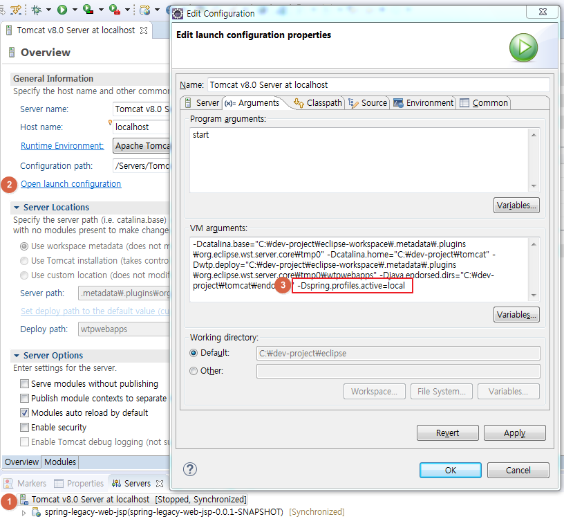

 spring-legacy-sample-project
==========================

# 1.소개
## 1.1. 목적
Spring 기반으로 진행되는 Web Application 프로젝트를 위한 샘플 소스입니다.


# 2.개발 표준
## 2.1. Application 개발환경

| 구분 |  제품명 | Version |  비고 |
| ----- | ----- | ----- | ----- |
| 개발언어 | Java | 1.8.0_102 |  |
| DBMS | H2 Database | 1.4.1 | 임시 |
| WAS | Tomcat | 8.0 | Servlet 3.1 |
| Framework | Spring Framework | 4.3.12 | Batch, Security 포함 |
| ORM | MyBatis | 3.4.5 |  |
| UI | Bootstrap, jQuery |  |  |
| IDE | Eclipse | 4.7.2 (Oxygen) |  |

## 2.2. 디렉토리 구조
Maven 프로젝트에서 정의된 Web Application을 위한 Standard Directory Layout 구조를 따릅니다. 

```
├── src/main/java
│   ├── {업무레벨1}.{업무레벨2}
│   │    ├── batch               * Spring Batch 관련 패키지
│   │    │   ├── tasklet           * tasklet 패키지
│   │    │   ├── scheduler         * scheduler 패키지 
│   │    │   ├── listener          * listener 패키지       
│   │    │   └── item              * ItemReader, Writer, Processor 패키지
│   │    ├── service             * Service 인터페이스 패키지
│   │    ├── dao                 * Dao 인터페이스 패키지
│   │    └── model               * Model 클래스 패키지 
│   │    
│   └── {업무레벨1}.common       * 공통 소스 패키지
│        ├── configuration         * Java Config 관련 패키지
│        ├── interceptor           * interceptor 패키지
│        └── utils                 * 공통 유틸 패키지 
│
├── src/main/resources
│   ├── config
│   │    ├── batch
│   │    │    └── job            * Spring Batch Job xml 설정파일 폴더
│   │    ├── log                 * Logback 설정파일 폴더
│   │    ├── spring              * Spring 설정파일 폴더
│   ├── message                  * 메시지 프로퍼티 파일폴더
│   └── sql                      * Mybatis 설정 파일 및 mapper.xml 폴더
│
├── src/main/webapp
│   ├── resources                * web static resource 폴더 (js,css,images 등)
│   │    ├── css                 * css 파일 폴더
│   │    ├── images              * 이미지 파일 폴더
│   │    └── js                  * js 파일 폴더
│   └── WEB-INF
│        └── jsp                 * jsp view 파일 폴더
└── src/test/java
    └── {업무레벨1}.{업무레벨2}  * 테스트 클래스 패키지
```

## 2.3. Naming Convention

### 2.3.1. Naming 개요
- 모든 명칭은 의도가 명확하고 이해가 가능한 Full English 조합 방식을 사용합니다. 
- 잘 알려진 단어는 이니셜로 표기하지 말고 Full English 명사로 표시합니다. 
- 단어를 2개 이상 조합하는 경우 Camel 표기법을 따릅니다. `ex) userService`
- 단순히 값을 반환하는 것이 아닌 복잡한 처리가 일어나는 method라면 get 대신 의미있는 이름을 사용합니다. `ex) loadUserByUsername`

### 2.3.2. Package Naming Rules
- package 명은 모두 소문자를 사용합니다.
- 모든 package는 {domain이름}.{업무레벨1}.{업무레벨2} 으로 시작합니다. 
`ex) joyoungc.github.io.web.user`

### 2.3.3. Class Naming Rules
- Class 이름은 명사를 사용합니다. 
- 첫 글자는 대문자로 시작하며, 단어를 2개 이상 조합하는 경우 Camel 표기법을 따릅니다. `ex) AdminService`
- 단어를 구분하기 위해서 밑줄(`_`)을 사용하지 않습니다. 

> ex) Layer별 Class 명명 규칙

| Layer 계층 |  접미사 | 예제 |
| ----- | ----- | ----- |
| Controller | [명사] + Controller.java | UserController.java |
| Service | [명사] + Service.java | UserService.java |
| Value Object | [명사].java | User.java |
| Data Transfer Object | [명사] + DTO.java | UserDTO.java |
| SQL Mapper XML | [명사] + -mapper.xml | user-mapper.xml |
| Utility Class | [명사] + Utils.java | CommonUtils.java |


### 2.3.4. Method Naming Rules
- method 이름은 동사를 사용합니다. 
- 동사만으로 의미 전달이 힘들경우 동사 + 명사로 사용합니다. 
- Annotation은 method 정의 바로 위에 위치합니다.
```java
   @GetMapping("/admins/{adminId}")
   @ResponseBody
   public Admin getAdmin(@PathVariable String adminId) {
      return adminService.getAdmin(adminId);
   }
```


| Role |  prefix | subfix | example |
| ----- | ----- | ----- | ----- |
| 생성 | create |   | createUser() |
| 수정 | update |   | updateUser() |
| 삭제 | delete |   | deleteUser() |
| 단건조회 | get |   | getUser() |
| 목록조회 | select |   | selectUser() |
| 실행(배치,복합로직) | execute |   | executeBatch() |


### 2.3.5. Constant Naming Rules
- 영어 대문자를 사용합니다. 
- 단어와 단어 사이에는 밑줄(`_`)로 연결합니다. 
```java
   public static final int MAX_REQUEST_COUNT = 5;
```

### 2.3.6. VO(or DTO) Naming Rules
- DB Table과 1:1로 매핑되는 VO는 테이블명과 동일한 이름을 사용합니다.
- DTO 구현시 static nested class로 Create(생성요청), Update(수정요청), Read(조회요청), Response(응답)를 구현합니다.

| - | Table이름 |  VO명 | 생성요청 | 수정요청 | 조회요청 | 응답 |
| ----- | ----- | ----- | ----- | ----- | ----- | ----- |
| Naming | TB_USER | User.java  | UserDTO.Create  | UserDTO.Update | UserDTO.Read | UserDTO.Response |

```java
public class UserDTO {
   
   @Data
   public static class Create {
      private String userId;
      private String userName;
      private String password;
   }
   
   @Data 
   public static class Update {
      private String userName;
      private String password;
      private Integer enabled;
   }
   
   @Data
   public static class Read {
      private String userId;
      private String userName;
   }
   
   @Data
   public static class Response {
      private String userId;
      private String userName;
      private String password;
      private Integer enabled;
      private String createDatetime;
      private String updateDatetime;
   }

}

```

## 2.4. Spring Framework
### 2.4.1. Configuration
#### 2.4.1.1. XML Config
XML 파일로 구성된 Configuration 목록입니다. 
- Spring Common Config
- Spring Batch (include TaskExecutor, Scheduler)
- Datasource
- TaskExecutor, Scheduler
- MessageSource
- Validator
- ViewResolver
- Interceptors

#### 2.4.1.2. Java Config
Java Config(Annotation기반)으로 구성된 Configuration 목록입니다. 
- Spring Security
- MyBatis
- MultipartResolver (Apache Commons )
- ModelMapper
- CacheManager

#### 2.4.1.3. Annotation Description
- @Slf4j : 해당 클래스에 Slf4j log 변수를 사용할 수 있도록 설정해 줍니다. (by lombok lib)
- @Data : Object에 선언된 변수에 대해 getter, setter, toString 등을 자동 생성합니다. (by lombok lib)
- @Transactional : Service Layer에서 사용되며 method 단위로 적용. 단순 조회(Read)에서는 사용하지 않습니다. Create, Update, Delete가 실행되는 method에 적용합니다.
- @Scheduled : cron 형식으로 설정된 시간에 해당 method가 실행됩니다. 
- @Cacheable : 해당 method를 Cache 처리 합니다. 최초 호출 이후 다음 실행건에 대해서는 캐싱된 데이터로 처리됩니다.
- @Async : 해당 method를 비동기로 처리합니다. 


# 3.개발환경 설정

## 3.1. IDE 설치 (Eclipse or ETC)
### 3.1.1. Plugin 설치
#### 3.1.1.1. lombok plugin 설치
   1. C:\dev-project\maven\local\repository\org\projectlombok\lombok\1.16.16 의 lombok-1.16.16.jar 실행(더블클릭)

   2. `Specify location` 버튼 클릭 후 설치된 이클립스 location 설정
   3. `Install / Update` 버튼 클릭
   4. 설치 완료후 이클립스 재시작

#### 3.1.1.2. SVN Connector 설치
   1. <http://www.eclipse.org/subversive/latest-releases.php> 에 접속하여 `Subversive-4.0.5.I20170425-1700.zip` 파일 다운로드  
   2. <http://community.polarion.com/projects/subversive/download/eclipse/6.0/builds/?C=M;O=A> 에 접속하여 `Subversive-connectors-allplatforms-6.0.4.I20161211-1700.zip` 파일 다운로드  
   3. 이클립스 > Help > Install New Software
   
   4. `Add` 버튼 클릭 > Add Repository 창에서 `Archive` 클릭 > `Subversive-4.0.5.I20170425-1700.zip` 파일 첨부 
   
   5. `Select All` 클릭 후 `Contact all update sites during install to find required software` 체크해제
   6. Next > Next > `I accept the terms of the license agreement` 선택 후 Finish
   7. 이클립스 재시작
   8. `Subversive-connectors-allplatforms-6.0.4.I20161211-1700.zip` 파일로 3 ~ 7번 과정을 반복 

## 3.2. Maven 설치 및 설정
   1. <https://maven.apache.org/download.cgi> 에 접속하여 파일 다운로드
   2. C:\dev-project\maven에 압축 해제
   3. C:\dev-project\maven\conf\settings.xml파일을 편집하여 아래 설정 추가
   ```xml
   ...
   <localRepository>C:\dev-project\maven\local\repository</localRepository> <!-- artifacts가 저장되는 위치 지정 -->
	...
   <offline>true</offline> <!-- 외부 네트워크(인터넷) 접속이 불가능한 환경에서 설정 -->
   ```
   4. 이클립스 > Preference > Maven > User Settings
   
   5. User Setting을 C:\dev-project\maven\conf\settings.xml로 설정
   

## 3.3. Tomcat 설정
   1. <https://tomcat.apache.org/download-80.cgi> 에 접속하여 설치 파일 다운로드
   2. C:\dev-project\tomcat에 압축 해제
   3. 이클립스 > Preference > Server > Runtime Environment 
   
   4. `Add` 클릭 > Apache Tomcat v8.0 선택 후 `Next`
   5. `Browse` 클릭 후 C:\dev-project\tomcat 지정 > `Finish` > `Apply and Close`
   6. Servers > Tomcat 서버 더블 클릭 > Overview > Open launch configuration 클릭
   
   7. Arguments 탭 클릭 > VM arguments 에 `-Dspring.profiles.active=local` 추가


## 3.4. 소스 버전 관리
※ 프로젝트 환경에 따라 설정 정보 입력 예정


# 4.개발 가이드

## 4.1. 공통

### 4.1.1. Logging 처리
- LogBack 라이브러리를 이용하여 debug 및 중요한 정보 Tracing 처리를 합니다.  
- 로그레벨을 조정하여 로그를 남길 수 있도록 지원한다. 
> 주의) System.out.println() 사용을 최대한 피하도록 합니다. 

   1) 로그 Trace Level 설명

| Level |  역할 및 기능 | 개발자 사용여부 |
| ----- | ----- | ----- |
| error | 비즈니스 오류나 업무에서 발생되어서는 안되는 경우를 체크하기 위함 | X |
| debug | 개발 시 디버그를 위해 사용. <br>운영 시 디버그 로그가 남지 않는다. | X |
| warn  | 비즈니스 측면에서 충분히 발생할 수 있는 에러 상황에 대한 로그 기록시 사용.<br> 당장 조치할 성격이 아닌 경우 경고성으로 남긴다. | X |
| info  | 운영 시 정보 성격의 로그를 남길 때 사용한다. <br>예를 들어 사용자 최초 접속여부나  어개발 시 디버그를 위해 사용. <br>운영 시 디버그 로그가 남지 않는다. | X |


===========================================================================================================
===========================================================================================================


# Table of Contents
# [1. 소개](#introduction)
## &nbsp; [1.1. 목적](#)
## &nbsp; [1.2. 대상](#)

# [2. 개발 표준](#develop-standard)
## &nbsp; [2.x. Application 환경](#)
## &nbsp; [2.x. 디렉토리 구조](#)
## &nbsp; [2.x. Naming Convention](#)
## &nbsp; [2.x. Spring Framework](#)
### &nbsp;&nbsp; [2.x.x. Configuration](#)
#### &nbsp;&nbsp;&nbsp; [2.1. XML Config](#)
#### &nbsp;&nbsp;&nbsp; [2.2. Java Config](#)
#### &nbsp;&nbsp;&nbsp; [2.3. Annotation Description](#)
## &nbsp; [2.x. Spring Batch](#)
## &nbsp; [2.x. Spring Security](#)

# [3. 개발환경 설정](#develop-env)
## &nbsp; [3.x. IDE 설치](#)
## &nbsp; [3.x. Maven 설치 및 설정](#)
## &nbsp; [3.x. 소스버전관리 ](#)

# [4. 개발가이드](#13-annotation-description)
## &nbsp; [4.1. 공통](#)
### &nbsp;&nbsp; [4.1.1. Logging 처리](#)

## &nbsp; [4.x. 신규 모듈 개발](#)
## &nbsp; [4.x. SQL가이드](#)
#### &nbsp;&nbsp;&nbsp; [4.x.x. 업무쿼리모음 ](#)

## &nbsp; [4.x. 빌드 및 배포](#)
## &nbsp; [4.x. 모니터링](#)
